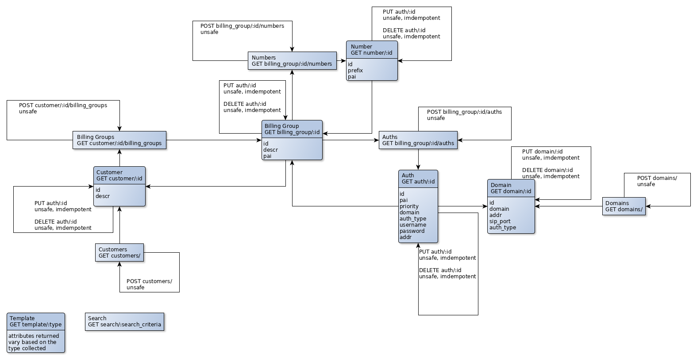

Magic Strings
=======

## Semantic Descriptors
A list of DOM names that will be returned within Items.

`addr` An IP address

`auth_type` The type of authentication used to identify a SIP subscriber.

`descr` A description of an item.

`domain` A fully qualified domain name.

`id` A unique identifer for a resource.

`pai` An identifier (usually a 10-digit telephone number) that is used in the P-Asserted-Identity SIP header and identifies the bill-to subscriber.

`password` A secure password.

`prefix` A Telephone number prefix (left-to-right matching) used to route calls to a subscriber.

`priority` An integer representing the priority an authorization has in the system. (lower number is higher priority)

`sip_port` An integer representing the port used for SIP communications for a PBX.

`username` A unique name used to log into a system.

## Link Relations
Each relationship defines "how" links relate to their item.

`child` A child of the item requested.

`collection` A placeholder, linking to a collection of items.

`parent` The parent of the item requested.

`peer` A peer of the item requested.

`template` A resource containing a template to create a new resource

State Diagram
=======

Resources
=======
Resources work on the CRUD principle, for a visual representation of how these resources are tied together, please reference the state diagram.

`GET auth/:id`  
**Item**  
Returns a representation of a single authentication identified by the id parameter.

`PUT auth/:id`  
**Item**  
Updates a single authentication identified by the id parameter.

`DELETE auth/:id`  
Permanently deletes a single authentication identified by the id parameter.

`GET billing_group/:id`  
**Item**  
Returns a representation of a single billing group identified by the id parameter.

`PUT billing_group/:id`  
**Item**  
Updates a single billing group identified by the id parameter.

`DELETE billing_group/:id`  
Deletes a single billing group identified by the id parameter.

`GET billing_group/:id/auths`  
**Collection**  
Returns a list of authentications for a single billing group identified by the id parameter.

`POST billing_group/:id/auths`  
**Collection**  
Accepts a template to provision a new authentication for a single billing group identified by the id parameter.

`GET billing_group/:id/numbers`  
**Collection**  
Returns a list of provisioned numbers for a single billing group identified by the id parameter.

`POST billing_group/:id/numbers`  
**Collection**  
Accepts a template to provision a new number for a single billing group identified by the id parameter.

`GET customer/:id`  
**Item**  
Returns a representation of a single customer identified by the id parameter.

`PUT customer/:id`  
**Item**  
Updates a single customer identified by the id parameter.

`DELETE customer/:id`  
Deletes a single customer identified by the id parameter.

`GET customer/:id/billing_groups`  
**Collection**  
Returns a list of billing groups for a single customer identified by the id parameter.

`POST customer/:id/billing_groups`  
**Collection**  
Accepts a template to provision a new billing group for a single customer identified by the id parameter.

`GET customers/`  
**Collection**  
Returns a list of provisioned customers.

`POST customers/`  
**Collection**  
Accepts a template to provision a new customer.

`GET domain/:id`  
**Item**  
Returns a representation of a single domain identified by the id parameter.

`PUT domain/:id`  
**Item**  
Updates a single domain identified by the id parameter.

`DELETE domain/:id`  
Deletes a single domain identified by the id parameter.

`GET domains/`  
**Collection**  
Returns a list of provisioned domains.

`POST domains/`  
**Collection**  
Accepts a template to provision a new domain.

`GET number/:id`  
**Item**  
Returns a representation of a single number prefix identified by the id parameter.

`PUT number/:id`  
**Item**  
Updates a single number identified by the id parameter.

`DELETE number/:id`  
Deletes a single number prefix identified by the id parameter.

`GET search/:search_criteria`  
**Collection**  
Returns a list of customers, billing groups, and numbers found by the search_criteria.

`GET template/:type`  
Returns a representation of a template used to create items.  
Valid types are: `auth`, `billing_group`, `customer`, `domain`, and `number`.
